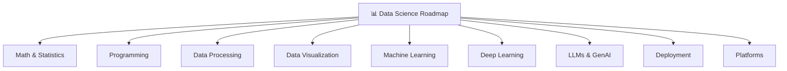

# 📊 Data Science Roadmap
-----

---

## 🧮 Math & Statistics

✨ Click to expand

# Topics :
- Linear Algebra 
- Calculus 
- Probability 
- Statistics

---

## 💻 Programming

✨ Click to expand

| Area | Tools |
|----|----|
| Languages | Python, R |
| Databases | SQL |
| Version Control | Git, GitHub |

---

## 🧹 Data Processing

✨ Click to expand

| Libraries | Use | 
|-----------|------|
| Pandas    |Data manipulation | 
| NumPy | Numerical computing | 
| PySpark   |Big data processing |
| Polars    |Fast DataFrames|

---

## 📊 Data Visualization

✨ Click to expand

| Type     | Tools               |
| -------- | ------------------- |
| Code     | Matplotlib, Seaborn |
| BI Tools | Tableau, Power BI   |

---

## 🤖 Machine Learning

✨ Click to expand

**Theory**
- Supervised Learning  
- Unsupervised Learning  

**Tools**
- Scikit-learn  
- XGBoost  
- LightGBM  

**Build Projects**

---

## 🧠 Deep Learning

✨ Click to expand

**Theory**
- Neural Networks  
- CNN  
- RNN  

**Tools**
- TensorFlow  
- Keras  
- PyTorch  

**Build Projects**

---

## 🚀 LLMs & GenAI

✨ Click to expand

**Theory**
- Prompt Engineering  
- Embeddings  
- RAG  

**Tools**
- OpenAI  
- Hugging Face  
- LangChain 

**Build Projects**

---

## 🚢 Deployment

✨ Click to expand

| Tool      | Purpose        |
| --------- | -------------- |
| Streamlit | App deployment |
| MLflow    | Model tracking |
 

---

## ☁️ Platforms

✨ Click to expand

- AWS  
- Azure  
- Databricks  

